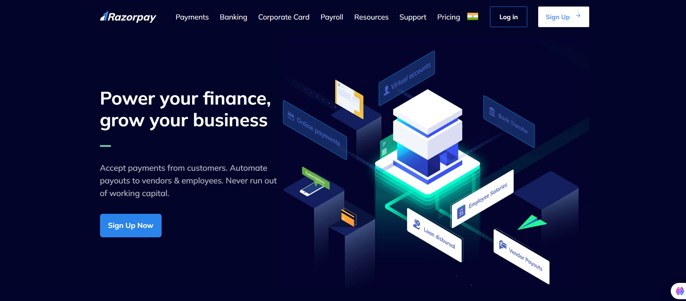

<h1 align="center">💳 Razorpay Landing Page Clone</h1>

<p align="center">
  A modern, responsive frontend clone of the Razorpay homepage.<br>
  Built using <b>HTML, CSS, TailwindCSS</b> to enhance UI and layout skills.
</p>

<p align="center">
  
  
  
</p>

---

## 📸 Preview

<p align="center">
  
</p>

---

## 🚀 Features

- 🎨 Clean and accurate Razorpay UI replication  
- 📱 Fully responsive design  
- ⚡ TailwindCSS used for modern styling  
- 🧩 Organized folder structure  
- 🖼️ Optimized asset usage (fonts & images)  

---

## 🛠 Tech Stack

| Technology | Purpose |
|-----------|---------|
| **HTML5** | Structure |
| **CSS3 / TailwindCSS** | Styling, layout, responsiveness |
| **JavaScript (optional)** | Interactions |


---

## 📂 Folder Structure

```bash
razorpayClone/
├── fonts/
├── images/
├── node_modules/
├── index.html
├── style.css
├── tailwind.config.js
├── postcss.config.js
├── package.json
├── package-lock.json
├── .gitignore
└── README.md
```


---

## 🧪 How to Run Locally  

```bash
# Clone the repo
git clone https://github.com/PranavGoel26/Razorpay-frontend.git

# Navigate into folder
cd discordClone

# Install dependencies
npm install

# Start Tailwind build
npx tailwindcss -i ./main.css -o ./dist/output.css --watch

# Open index.html in browser

```